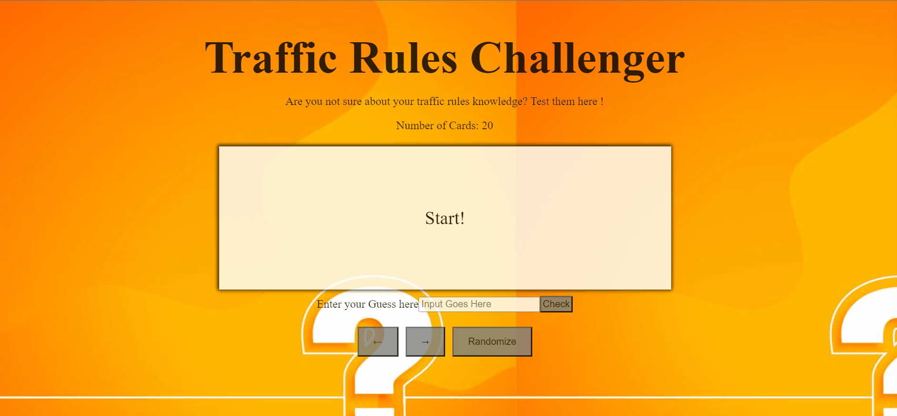

## Traffic FlashCards

**Traffic FlashCards** is an interactive web application that helps users test and improve their knowledge of traffic rules. Users can guess answers to traffic-related questions on flashcards before revealing the correct responses. With features like instant feedback and easy navigation, this app makes learning about road safety engaging and effective. Perfect for anyone preparing for a driving test or looking to refresh their traffic knowledge!

## 🚦 Traffic FlashCards: Features Overview

### 📝 User Interaction
- **Interactive Guessing**
  - Users can enter their guess in a text box before revealing the answer on the flip side of the card.
  
- **Instant Feedback**
  - Clicking the submit button provides visual feedback indicating whether the answer was correct or incorrect.

### 🔄 Navigation Controls
- **Back and Next Buttons**
  - A **Back** button allows users to return to the previous card in the sequence.
  - A **Next** button enables users to navigate to the following card seamlessly.

### 🎲 Future Enhancements
- **Shuffle Feature**
  - A shuffle button will be implemented to randomize the order of the cards, providing a varied learning experience.

### 🌟 User Experience
- **Smooth Navigation**
  - Intuitive interface design ensures easy navigation through flashcards.
  - Engaging user experience with clear visual cues and feedback.

## 📹 Video Walkthrough

Here's a walkthrough of how the **Traffic FlashCards** application works and how it can be used. This video demonstrates the interactive features, including how to enter guesses, receive feedback, and navigate through the flashcards effectively.

GIF created with ScreenToGif 

## License

    Copyright [2024] Maanvik Thodupunuri

    Licensed under the Apache License, Version 2.0 (the "License");
    you may not use this file except in compliance with the License.
    You may obtain a copy of the License at

        http://www.apache.org/licenses/LICENSE-2.0

    Unless required by applicable law or agreed to in writing, software
    distributed under the License is distributed on an "AS IS" BASIS,
    WITHOUT WARRANTIES OR CONDITIONS OF ANY KIND, either express or implied.
    See the License for the specific language governing permissions and
    limitations under the License.
